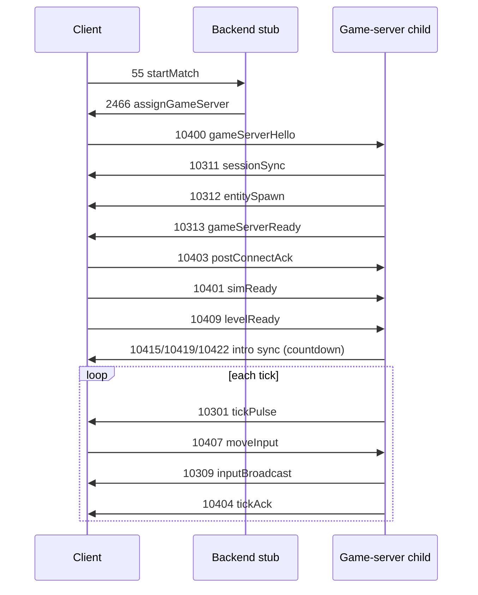

# LinkUpdater deobfuscation notes

Source: `brawlhalla-src/dump/scripts/LinkUpdater.as`, `class_725.as` (type-id init), `class_139.as` (game-server TCP).

Machine-readable handler map: [`linkupdater-map.json`](./linkupdater-map.json) (221 registered handlers).  
Type aliases: [`../src/packet-aliases.generated.ts`](../src/packet-aliases.generated.ts) (428 numeric ids).

## Architecture

`LinkUpdater` is the client-side network façade. It does **not** parse TCP framing — `class_85` / `class_139` do that. LinkUpdater owns:

| Piece            | Field / method                                        | Role                                                                                                                                              |
| ---------------- | ----------------------------------------------------- | ------------------------------------------------------------------------------------------------------------------------------------------------- |
| Type-id table    | `class_725` static init (`LinkUpdater.var_7048`)      | Assigns every packet numeric id (starts at `class_245.var_9546 - 1` → **15**, then sequential jumps e.g. 30, 178, 500, 2300, 10300, 10400, 12000) |
| Receive dispatch | `var_1658: Vector.<Function>` filled in `method_2986` | `method_1330(packet)` → `var_1658[type](packet)` when `type < var_12853`                                                                          |
| Send helpers     | `method_4191` / `method_2379` / `method_7041`         | Build `class_279` bitstreams and queue on backend or game-server socket                                                                           |
| Seq policy       | `method_1350` (send), `method_6265`                   | Types `< var_10776` (500) get seq unless excluded (16, 178, 2463, 2467, …)                                                                        |

Dump names (`var_9413`, etc.) come from the **var_7032** slot table in `class_725.as`. LinkUpdater static field names sometimes differ by ±1 digit (e.g. dump `var_5600` vs init `var_5607` for legend pick) — always trust the **numeric id**.

## Backend vs game-server traffic

| Phase            | Socket                                       | Typical types                                    |
| ---------------- | -------------------------------------------- | ------------------------------------------------ |
| Main menu / auth | Backend TCP (`class_139.var_6627`)           | 178, 30, 12000, 20/88, 2431, 12100, 33–55 lobby  |
| Match transfer   | Backend then new TCP+UDP                     | 2466 → client opens game ports → **10400** hello |
| In-match sim     | Game-server TCP (+ UDP via **10316** tunnel) | 10310–10316, 10401–10422                         |

Our stub splits the same way: `stub.ts` / `room-replies.ts` on backend port; `game-child-runtime.ts` on assigned game TCP.

## Gameplay packet catalog (103xx / 104xx)

Prioritized for stub completeness. Handler = `LinkUpdater.method_*` from `var_1658`.

| Id    | Alias              | var (dump) | Direction | Handler       | Payload (sketch)                                                                | Stub status                                |
| ----- | ------------------ | ---------- | --------- | ------------- | ------------------------------------------------------------------------------- | ------------------------------------------ |
| 10300 | `transferFailed`   | var_3514   | S→C       | `method_6725` | bool                                                                            | **Not sent** (only on failure)             |
| 10301 | `tickPulse`        | var_8486   | S→C       | `method_6892` | uint tick; client acks via input pipeline                                       | **Implemented** (`game-input.ts`)          |
| 10302 | `playerReconnect`  | var_14908  | S→C       | `method_4515` | entity id → UI toast                                                            | **Gap** — not emitted                      |
| 10303 | `playerDisconnect` | var_11924  | S→C       | `method_1337` | entity id + reason                                                              | **Gap** — not emitted                      |
| 10304 | `entityState`      | var_8091   | S→C       | `method_3520` | entity id, tick, code                                                           | **Stub** — minimal encode, no real sim     |
| 10305 | `inputHistory`     | var_11598  | S→C       | `method_7070` | batched inputs (no tick advance)                                                | **Gap** — decode only                      |
| 10306 | `matchEnd`         | var_2471   | S→C       | `method_3721` | triggers `method_214` / match teardown                                          | **Gap**                                    |
| 10307 | `entityRespawn`    | var_8260   | S→C       | `method_2473` | entity id, tick, stock, flags                                                   | **Stub** — fixed respawn frame             |
| 10308 | `entityRollback`   | var_12769  | S→C       | `method_3964` | entity id, tick, rollback key                                                   | **Gap**                                    |
| 10309 | `inputBroadcast`   | var_6185   | S→C       | `method_2963` | tick + N × (entity 4b, input tick, input 14b)                                   | **Implemented**                            |
| 10310 | `matchSetup`       | var_5141   | S→C       | `method_8497` | level id, playlist, large player/legend block (`method_7426` on alternate path) | **Partial** — short header only            |
| 10311 | `sessionSync`      | var_3      | S→C       | `method_8604` | bool clear-transfer + token string                                              | **Partial** — encode/decode, minimal token |
| 10312 | `entitySpawn`      | var_7923   | S→C       | `method_288`  | loop: entity metadata until bool false                                          | **Partial** — one synthetic entity         |
| 10313 | `gameServerReady`  | var_3324   | S→C       | `method_4724` | bool ready + tick                                                               | **Partial** — bool+tick only               |
| 10314 | `canQuitNoPenalty` | var_10734  | S→C       | `method_7952` | (empty) UI message                                                              | **Gap**                                    |
| 10315 | `entityPoke`       | var_1712   | S→C       | `method_3926` | entity id + value                                                               | **Gap** — decode only                      |
| 10316 | `udpTunnel`        | var_5078   | S→C       | `method_8562` | opaque bytes → `class_647` UDP mux                                              | **Partial** — echo/tunnel stub             |
| 10400 | `gameServerHello`  | var_9886   | C→S       | —             | user id + session token (`class_139.method_1819`)                               | **Receive/log**                            |
| 10401 | `simReady`         | var_14245  | C→S       | —             | empty (`class_139.method_3208`)                                                 | **Handled**                                |
| 10403 | `postConnectAck`   | var_8410   | C→S       | —             | empty (`class_139.method_672`)                                                  | **Handled**                                |
| 10404 | `tickAck`          | var_7095   | C→S       | `method_2517` | uint tick                                                                       | **Handled**                                |
| 10405 | `gameConnect`      | var_3975   | C→S       | —             | user id + token (`class_139.method_5894`)                                       | **Decode**                                 |
| 10407 | `moveInput`        | var_5618   | C→S       | —             | entity move sample (`class_288.method_2934`)                                    | **Handled**                                |
| 10409 | `levelReady`       | var_174    | C→S       | —             | empty (`LinkUpdater.method_4981` sends **to** server)                           | **Handled**                                |
| 10415 | `introPlayerSync`  | var_12127  | S→C       | —             | intro ruleset (`method_8956`)                                                   | **Passthrough**                            |
| 10419 | `introEntitySync`  | var_4272   | S→C       | —             | intro entity batch (`method_8218`)                                              | **Passthrough**                            |
| 10422 | `introAuxSync`     | var_6928   | S→C       | —             | aux intro (`method_8713`)                                                       | **Passthrough**                            |

### Intro / level-load sequence (from dumps + captures)



## Lobby / auth catalog (implemented vs gap)

| Id           | Alias                         | Stub                           |
| ------------ | ----------------------------- | ------------------------------ |
| 178 / 30     | protocolHello / clientVersion | Log + expect                   |
| 12000        | loginChallenge                | **Reply** after version        |
| 20 / 88      | loginRequest                  | Log (redact ticket) + **2431** |
| 2431         | loginAccepted                 | Minimal snapshot               |
| 33 / 38      | create / join custom          | **2445** + **2449**            |
| 37           | updateSettings                | **2448**                       |
| 41 / 44 / 80 | legend / bot / local join     | **2449** / lobby refresh       |
| 55           | startMatch                    | **2466** + spawn game listener |
| 12100        | keepalivePing                 | Pong                           |

**Lobby gaps (lower priority than gameplay):**

- **43** `lockReady` — client sends 1 byte; no ack required today
- **47** `lobbyTabPing` — empty keepalive in room UI
- **70** `steamOverlayPing` — post-login empty packet
- **155**, **184**, **2300** — post-login store/playlist requests; stub ignores
- **2400–2555** — large backend feature surface (friends, ranked, store, rematch). Most have handlers in `var_1658` but are irrelevant for custom-room stub.

## Handler highlights (deobfuscated)

### `method_288` (10312 entitySpawn)

Reads a loop while bool: entity id, user id, name strings, packed uints, optional bot flag. Calls `method_7799`, switches music, `class_459.method_2713(true)`. This is the **real** spawn path — our stub sends a single hard-coded record.

### `method_8497` (10310 matchSetup)

Calls `method_214(param1, false)` (stores level/playlist ids), sets `var_3592 = 1048576`, hides loading UI. Full payload when sent from `method_7426` includes level type, tick, player count, per-player legend/loadout (`class_287` records) — **~hundreds of lines** in the handler.

### `method_2963` / `method_1685` (10309 / 10305)

Same batched input layout: `uint count` then per entry `entityId (4 bits)`, `inputTick`, `inputBits (14 bits)`. `method_2963` applies inputs and advances rollback; `method_7070` only buffers (`param2=false` in `method_1685`).

### `method_6892` (10301 tickPulse)

Reads tick, calls `method_4363(tick)`, increments stats, sends **another** 10301 via `method_2379` (client-side keepalive of tick loop). Server should **not** mirror that echo — our stub only sends one pulse per client tick.

### `method_8562` (10316 udpTunnel)

Delegates to `var_1908.method_1750` → UDP multiplex. Needed for Network Next / RTT — we stub with pass-through.

## Gap summary (priority order)

1. **matchSetup body (10310)** — must encode real level + player legend rows or client hangs in transfer (`Error_FAILED_TRANSFER` path uses 10300).
2. **entitySpawn loop (10312)** — multiple entities, bot flags, legend ids from lobby state.
3. **Intro trio (10415/10419/10422)** — need real bit layouts from `method_8956` / `method_8218` / `method_8713`, not empty passthrough.
4. **Simulation fidelity** — entityState/Respawn/Rollback/Poke (10304–10308, 10315) for stocks and hits.
5. **Player lifecycle** — reconnect/disconnect (10302/10303).
6. **UDP tunnel (10316)** — proper `class_647` framing if/when enabling UDP.
7. **Backend social/store** — 24xx/29xx/101xx families (defer).

## Regenerating aliases

```bash
node --experimental-transform-types apps/backend/scripts/generate-packet-aliases.mts
```

Edit curated names in that script, then rebuild. Types without curated names become `toExplore_<varName>` in `packet-aliases.generated.ts`.

## Related client entry points

| Action       | Send site                                   |
| ------------ | ------------------------------------------- |
| Handshake    | `class_139.method_7612` → 178, 30           |
| Login ticket | `class_139` ~3453 → 20/88                   |
| Create room  | `LinkUpdater.method_944` → 33               |
| Legend pick  | `LinkUpdater.method_6666` → 41 (`var_5607`) |
| Add bot      | `LinkUpdater.method_6324` → 44              |
| Start match  | `class_104.method_8137` → 55                |
| Game hello   | `class_139.method_1819` → 10400             |
| Move input   | `class_288.method_2934` → 10407             |
